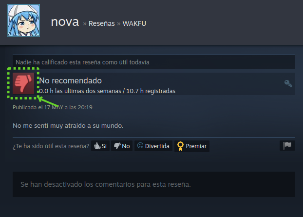

# Web Scraping Steam Review Like/Dislike



Web Scraping usando [Scrapy Spider](https://docs.scrapy.org/en/latest/index.html) para obtener el resultado de la reseña de un usuario sobre un juego en la Tienda Steam (like/dislike), a partir de una lista de urls con el siguiente formato:

`data.csv`
```csv
url
https://steamcommunity.com/profiles/<user_id>/recommended/<product_id>
https://steamcommunity.com/id/<username>/recommended/<product_id>
...
```

Campos:
- `user_id` es el id usuario de Steam.
- `username` es el nickname del usuario en Steam.
- `product_id` es el id del juego en la Tienda Steam.

Los mismos deben encontrarse dentro de `data.csv` (ejemplo incluido dentro del repositorio).

## Uso
Crear un entorno de python y activarlo (ej. [virtualenv](https://github.com/pypa/virtualenv)):
```
virtualenv env -p python3
source env/bin/activate
```

Clonar el repositorio:
```
git clone https://github.com/bruino/scraping-reviews-steam.git
```

Ir al directorio `scraping-reviews-steam`:
```
cd scraping-reviews-steam
```

Instalar las librerías:

```bash
pip install -r requirements.txt
```

Ejecutar:
```bash
scrapy crawl steam -o steam_reviews_likes_users.jl
```

El resultante es un archivo `steam_reviews_likes_users.jl` del tipo [Json Line](https://jsonlines.org/).
```json
{"game": "357070", "user": "bruino", "recommended": 1}
...
```

## Atención
Debido a que en algunos casos surgen redireccionamientos (HTTP Redirect Status) y algunos perfiles de usuarios de Steam son privados, se aplico la siguiente configuración que omite aquellos casos especiales.

`settings.py`
```python
REDIRECT_ENABLED = False
```